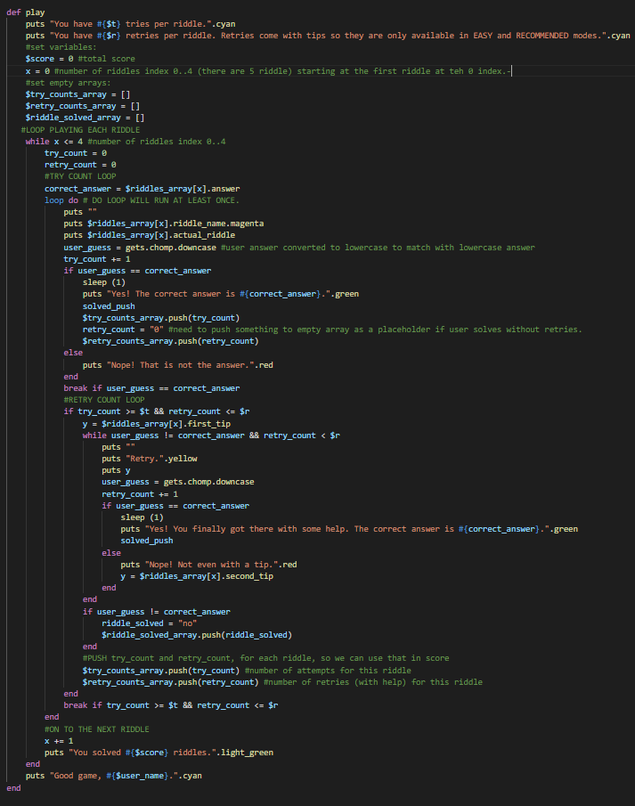
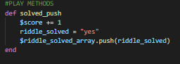
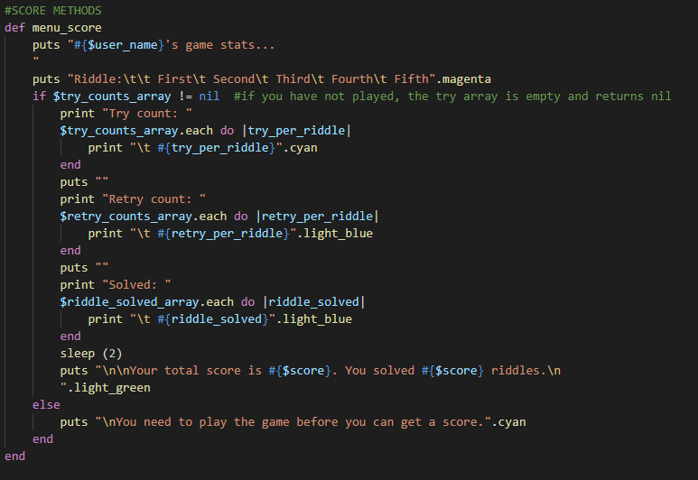
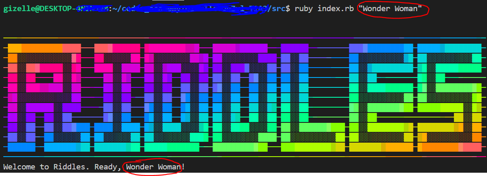
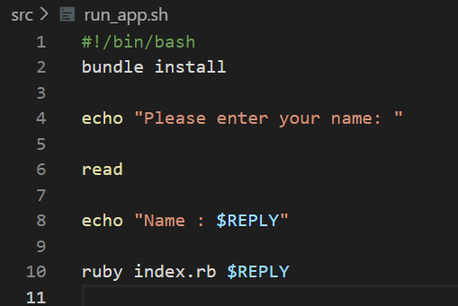
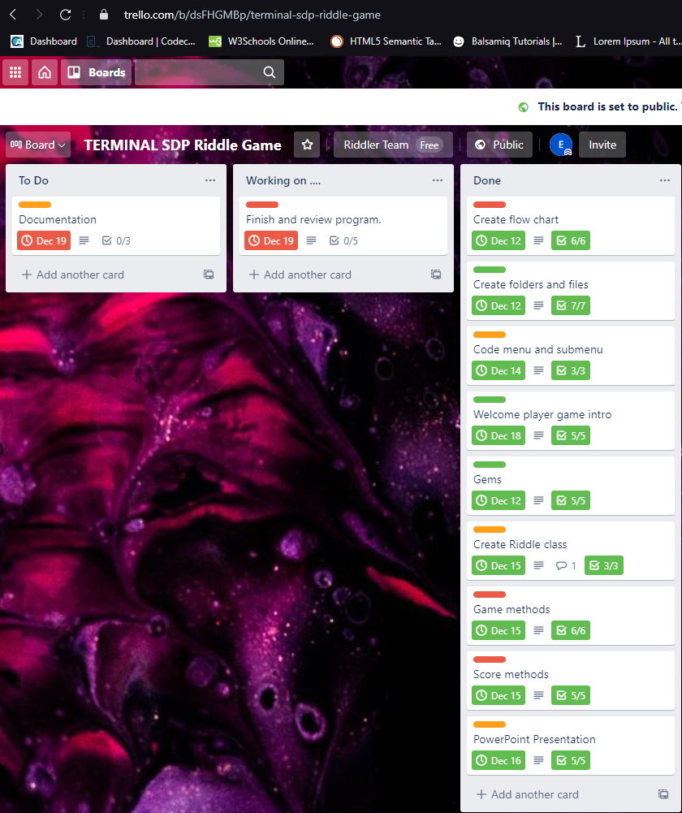
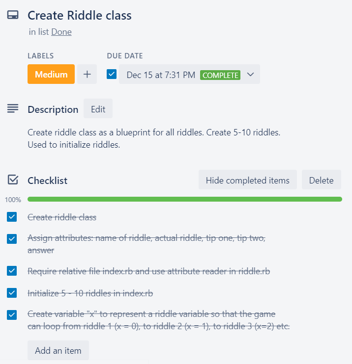
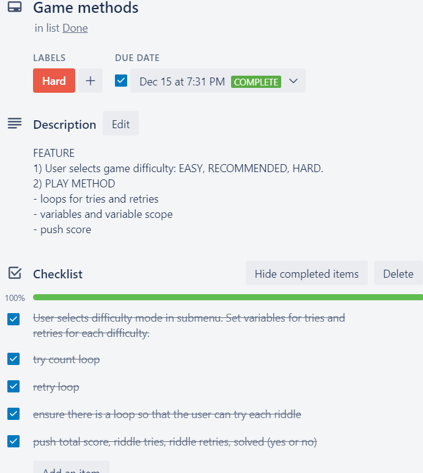
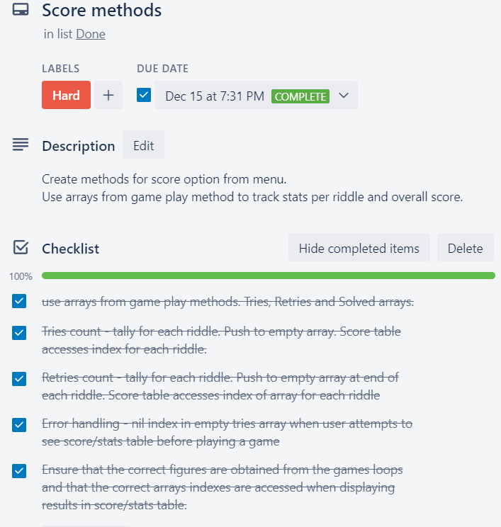

# Riddles Game
#### Ruby Terminal App_ T1A3
###### Built and designed by: Gizelle v.Z.
-----
#### R4 Link to source control repository
Github Repository: https://github.com/Ellezique/ruby-riddles-game

### Software Development Plan (SDP)

#### R5 Statement of Purpose and Scope
Riddles is a ruby terminal application game that challenges the user to solve 5 riddles. 
Each riddle has a one-word answer. When playing, the user will receive the riddle and have an opportunity to provide their one-word answer. If the user solves the riddle, or if they run out of attempts, they move to the next riddle until they have played all 5 riddles. If the user is unable to solve the riddle, they may attempt a set number of tries (how many will depend on the difficulty mode selected). 

The user may choose to play Easy, Recommended or Hard difficulty mode: 
-	Easy mode allows for a maximum of 3 tries per riddle. If the user cannot solve the riddle in those 3 tries, the game provides a maximum of 2 retries.
-	Recommended mode allows for a maximum of 2 tries and two retries. 
-	Hard mode allows for a maximum of only 2 tries.

Riddles can be frustrating, so Easy and Recommended modes will allow the user to receive an additional two retries, each with an additional tip to assist the user in their attempts to solve the riddle. It is possible that a riddle may have more than one possible answer, but traditional riddle games generally fail to make provision for this. This game has tips designed to point the user towards the specific sought answer and to assist them in solving the riddle by providing additional information.

The game will never provide the answer to riddles except so as to confirm a correct answer.  The game provides the user an opportunity to play each riddle without the temptation of ruining the riddle by being able to see the answers (as is often the case when riddles are printed in books and magazines which often display the answers elsewhere on the same page or within the same publication). For those who cannot bear not knowing the answers (or who wish to cheat), the credits page provides information about the riddles. The credits page also contains information about the game copyright as well as giving credit to two sources utilized in game development. 

The game will keep track of the total score and stats for each riddle i.e. whether the riddle was solved, how many tries and retries were utilised and the total overall score for each game. 

The purpose of the game is to make solving riddles more fun and interactive than merely reading the riddle and answer. There is no timer, so users are free to ponder each riddle and tip for as long as they would like. This overcomes the problem of on-the-spot pressure when an individual verbally shares a riddle with another.

The game has some color and ascii headers to make the application more visually appealing. The primary target audience consists of users who would like to solve riddles in a more engaging format. Secondary audiences include users who are interested in basic terminal applications and games.

#### R6 Features

##### Aesthetics
Ascii art was copied from an online generator and pasted as a string in the code. The lolize gem was used to color the Ascii headers for each section of the application. The colorize gem introduced solid color text. 

#####  Menus
The tty: prompt gem was used to build the menu and submenu to enable the user to easily select their option of choice.

##### Riddles Class
A riddles class is used as a blue print to initialize all 5 riddles with the same attributes:
- the riddle name, 
- actual riddle, 
- first tip,
- second tip, 
- answer 

##### Game
A game consists of looping through all 5 riddles enabling the user to attempt to solve each riddle, one at a time.
A variable `x` is assigned for the riddle number. Each time the riddle loop is completed, `x` is overriden to `x + 1` allowing the program to use the next riddle as it loops through all 5 riddles.

The user starts a game by selecting `Play` from the main menu and then selecting a difficulty mode `Easy`, `Recommended` or `Hard` from the submenu. Each difficulty mode assigns a set number of tries (determined by the `t` variable) and retries (`r` variable) for the entire game.

###### Tries Loop and Retries Loop
The user can try the riddle a maximum of `t` times. If they solve the riddle, they break out of this tries loop and move on to the next riddle. 
If not, they enter the retries loop and may retry a maximum of `r` times.  Each retry prints a new tip to help the user solve the riddle. If they solve the riddle or if they do not have any retries left, they break out of the loop and move on to the next riddle.

###### Score
The user can select Score from the menu. This section shows:
- the total number score (which is the total number of riddles solved), 
- and for each riddle it shows
a) total tries 
b) total retries 
b) whether the riddle was solved (yes or no).

The total score is tracked by a `score` variable (initially set to zero) that is overridden as `score = score + 1` each time a riddle is solved. 

Similarly tries count and retries count are two seperate variables that tally for each riddle. An empty tries count array and retries count array are set at the start of each riddle. They collect the total tries and retries for each riddle. Whether a riddle is solved or not, a `yes` or `no` will be pushed into a riddle solved array.

Once the user finishes a riddle (by solving or running out of tries and retries), the tries count and the retries count are pushed to the tries count array and retries count array, respectively. Here is an example of the push when a riddle is solved:

If the user attempts to view the score stats before playing a game, the arrays are empty so the indexes in the array do not exist. When the score table tries to access indexes in the empty array to print to the stats table, a nil error is returned. To prevent this, the arrays are only accessed if they are not empty. If they are empty, the program prints a message telling the user to play a game to get a score and stats first. This avoids the error.

##### Credits
A colorful page, accessed from the main menu, showing copyright and giving credit to the Ascii generator and riddles source.

##### Set name in command line
ARGV variables can be used to pass command line arguments to the entire ruby application when the application is executed. Here, a deafult user name is set as "Player One". The user can override the default name by entering their name of choice from the command line. In this example, the user wants the program to call them "Wonder Woman":

*[Note: error handling in below code:]*

When running or installing the application using `./run_app.sh` (see below "R10 How to Use and Install the Application"), the user will be prompted to `"Please enter your name: "`. If they type in their chosen name and hit enter, the application will use their chosen name throughout the program. If they leave it blank and just hit enter, the application will default to "Player One".

#### R7 User Interaction
The user runs the application to play the game. For instructions on the former, please see below at "R10 How to Use and Install the Application", which also includes information about customising the game to refer to you by your chosen name, rather than the default "Player One".

The player receives a welcome message. The program confirms that each riddle has a one word answer. The user may then select an option from the main menu: `Play`, `Score`, `Credits`, `Exit`. `Exit` closes the application.

Selecting game, will lead to a submenu asking the user to select a difficulty mode (they can still go `Back` to main menu if they decide not to play). 

In the following example, the user has chosen to play `Recommended` difficulty mode. The program confirms that they have 2 tries and two retries per riddle. The player has commited to the game and must now play to the end (this also assists the user in avoiding the temptation of leaving the game to go seek answers elsewhere). The game will progress through all 5 riddles regardless of how many, if any, riddles are solved. Gameflow is important to prevent a user from getting stuck on a riddle and quiting in frustration. The tips are also designed to keep the game moving and assist the user with new information if they are playing Easy or Recommended modes and having difficulty solving each riddle.

The user may type their answer in upper or lower case and submit their answer by hitting Enter on their keyboard. The program will convert their answer to lowercase (aka `.downcase`) to match against the set answer. The player should receive their point for solving a riddle, regardless of any case sensitivity.

The image below indicates 4 guesses to the first riddle (two tries and two retries) before moving to the next riddle. The game will tell the user whether their answer is correct or not. 

The application will allow a user to skip through if they keep hitting Enter on their keyboard.

The user can select `Score` from the main menu. If they go to `Score` before playing a game, there won't be a score to print. Instead of displaying an error, the score page will just tell the user to go play a game to get a score and stats.

Once the user has completed a game, they will be told how many riddles they have solved and that the game is over. The game will then prompt them to go visit the score page to see their game stats. 

The score page provides the total score along with the total number of tries and retries for each riddle, and whether the riddle was solved or not.

The user is, of course, free to play again and attempt to improve their score.

The user may select Credits from the main menu. Credits provides copyright information and references two sources used in game development. 

One of the references includes a link to more information about the riddles. If a user was unable to solve the riddle and cannot bear not knowing the answer, the credit page points them towards the source of the riddles...

#### R8 Control Flow Diagram

#### R9 Implementation Plan
The implementation plan was prepeared in Trello and is accessible online at: https://trello.com/b/dsFHGMBp/terminal-sdp-riddle-game

#### R10 How to Use and Install the Application

You may download the Riddles application and run it in Command Line.

###### Download 

Open the following link: https://github.com/Ellezique/ruby-riddles-game

Select the green "Code" button, which will then display a drop down menu. From the drop down menu, select "Download ZIP".

**PC**: Once the zip folder has downloaded, right click on the zip folder and select "Extract All" from the dropdown menu. You may then choose where you would like to save the extracted folder on your PC, but keep all these files together because they contain everything from the repository. 
**Mac**: You can unzip the folder from Finder. Click the unzip button and select "unzip" from the dropdown menu and select where you would like to extract the folder to. A Finder window will open. Select "unzip the entire zip file".

###### Open Command Line
You can find instructions for opening command line on MacOS, Linux and Windows [here](https://towardsdatascience.com/a-quick-guide-to-using-command-line-terminal-96815b97b955):[^1]

>- *MacOS: Open spotlight search (default way to do this is by hitting command and the space bar) and type in “terminal”. Select the application called terminal and press the return key. This should open up an app with a black background. When you see your username followed by a dollar sign, you’re ready to start using command line.*
>- *Linux: You can open Terminal by directly pressing [ctrl + alt + T] or you can search it up by clicking the “Dash” icon, typing in “terminal” in the search box, and opening the Terminal application. Again, this should open up an app with a black background. When you see your username followed by a dollar sign, you’re ready to start using command line.*
>- *Windows: On Windows 10, open the start menu and go to the shortcuts folder called “Windows System”. Pressing the dropdown menu should reveal a shortcut to open the Command Prompt application. Right click on the shortcut, press “More”, and press “Run as Administrator”. For Windows 8, go to the start screen, press “All Apps”, and scroll right until the “Windows System” folder shows up. You can find Command Prompt there. For Windows 7, open the start menu and click on “All Programs”. Click on “Accessories” and you’ll find the Command Prompt shortcut. Right click on the shortcut and press “Run as Administrator”.*

###### Run the Application
There are a few ways to run a .sh file. You can read about running an .sh file in Linux and Windows systems [here](https://www.webservertalk.com/run-sh-files-in-linux-and-windows/)[^2] and MacOS [here](https://www.addictivetips.com/mac-os/run-shell-sh-script-on-macos/)[^3]

For ease of reference, I provide the following instructions:

**First time**
- Open Command Line
- You need to give your computer permission to run the application. Type the following and hit Enter:
`chmod +x run_app.sh`
- Now open the run_app.sh file by typing the folliwng, then hit Enter:
`./run_app.sh`
- The application will ask you to enter your name. Please do enter your name if you would like the program to call you by your name. If you do not want to enter your name, just hit Enter and the program will refer to you as default "Player One".
- The `./run_app.sh` file will aslo instruct your computer to download bundler and all gems necessary to run the application. 

**Thereafter**
If you want to open the application again later:
- Open Command Line and open the application by typing the following, then hit Enter:
`./run_app.sh`

OR

If you are familiar with Command Line:
- Open Command Line
- Navigate into the directory location where you saved the extracted files
-  Type the following then hit Enter to run the program with default user name "Player One":
`ruby index.rb`
OR
- Type same followed by your "Name" (or whatever name you would like to be referred to) and hit Enter to customise the application to run using your chosen name:
`ruby index.rb "Name"`

[^1]: Wei, Jerry. "A Quick Guide to Using Command Line (Terminal)". 11 July 2019. Towards Data Science. https://towardsdatascience.com/a-quick-guide-to-using-command-line-terminal-96815b97b955
[^2]: Hitesh, J. "How to Run .SH Files in Linux & Windows Systems". 31 October 2019. Web Server Talk. https://www.webservertalk.com/run-sh-files-in-linux-and-windows/
[^3]: Wahab, Fatima. "How to run a Shell or .sh script on macOS". 18 April 2020. Addictive Tips. https://www.addictivetips.com/mac-os/run-shell-sh-script-on-macos/